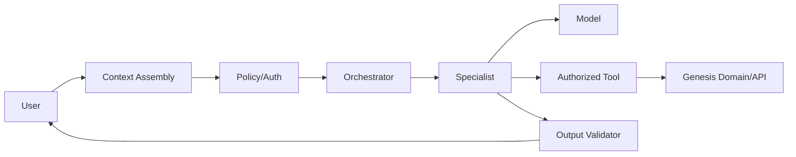

# AGENTIC ARCHITECTURE

## Objetivo

A IA amplia interpretação, síntese e planejamento. Não substitui score, autorização, consentimento ou verdade transacional.

## UX

O usuário conversa com **Conselho Genesis**.

Internamente:
- Orchestrator/Vision;
- Business Analyst;
- Operations;
- Commercial;
- Finance;
- Technology;
- AI;
- Risk/Tax conforme contexto.

Não expor sete chatbots como padrão.

## Pipeline

## Contrato

Cada run possui:
- objective;
- authorized context;
- tools;
- budgets;
- stop conditions;
- output schema;
- provenance;
- confidence;
- audit;
- fallback.

## Runtime

Agno: candidato a spike.
Adoção final só após licença, security, observability, cost/latency e exit-path gate.

## Kill switches

- agentic global;
- write tools;
- provider/model;
- domain regulated;
- tenant-specific.
