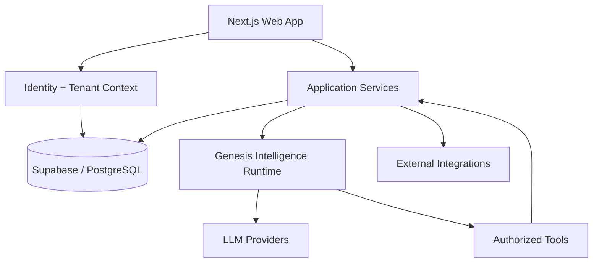
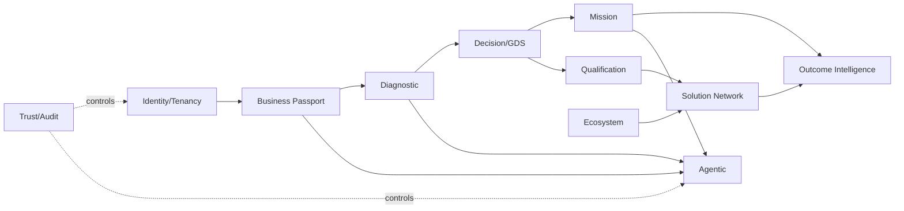

# ARQUITETURA MASTER - GENESIS 360 EMPRESARIAL V1

## Estilo

**Monólito modular primeiro**, com fronteiras explícitas e possibilidade de extração apenas por gatilho de escala, ownership, fault isolation, runtime ou compliance.

## Topologia

## Módulos de domínio

## Fonte de verdade

- identidade/tenant: Postgres + Supabase Auth;
- fatos da empresa: Business Facts;
- histórico: Timeline;
- score: Rules Engine persistido;
- decisão: Decision Record;
- missão/outcome: Mission tables;
- qualificação: Provider Capabilities;
- consentimento: consent versions/decisions;
- agente: nunca source of truth.

## Arquitetura de deploy V1

- uma aplicação Next.js;
- uma base PostgreSQL/Supabase;
- runtime agentic isolável como processo/serviço quando adotado;
- CDN/edge conforme provedor;
- observabilidade vendor-neutral quando viável;
- nenhuma exigência de microserviços, Kafka, graph DB ou multi-region active-active na V1.

## Trigger de revisão

Extrair módulo somente quando:
- escala independente comprovada;
- deploy independente gera valor material;
- isolamento de falha/compliance necessário;
- equipe/ownership independente;
- runtime incompatível justificado.
