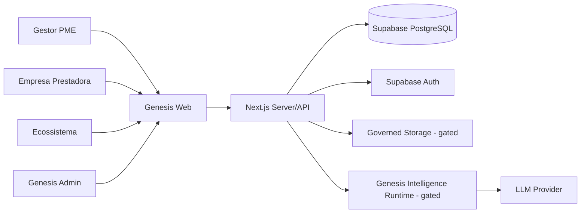
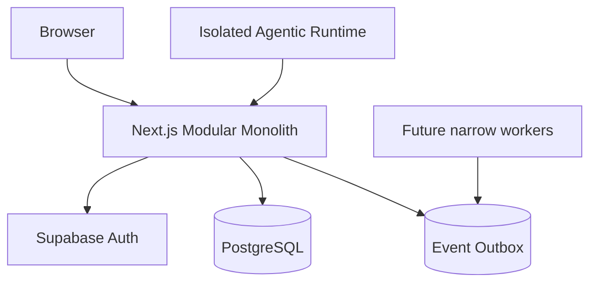

# Architecture Production Blueprint V1.2

## Decisão
Monólito modular com boundaries fortes.

A fundação atual não possui trigger que justifique microserviços.

## Contexto

## Containers

## Módulos
### Identity/Tenancy
Auth, membership, tenant context, roles.

### Passport
Facts, provenance, Timeline.

### Diagnostic
Question strategy, answers, score, coverage, confidence, pain findings.

### Decision
Cause hypotheses, GDS, evidence refs.

### Mission
Template, mission, evidence, outcome, lifecycle.

### Qualification
Capability taxonomy, provider capability, policy, eligibility, neutral ranking, contact.

### Trust/Governance
Consent, attestation, audit, outbox, privacy.

### Intelligence
Read-only authored tools, context ACL, model adapter, evals.

## Data source of truth
PostgreSQL é o source of truth transacional.

LLM output é:
- draft;
- derived;
- versioned;
- never authoritative without contract/promotion.

## Consistency
Strong consistency:
- tenant auth;
- consent decisions;
- score submission;
- mission transition;
- qualification status;
- contact creation.

Eventual/asynchronous:
- notifications;
- analytics;
- non-critical enrichments.

## Failure policy
- auth unknown → deny;
- tenant unknown → deny;
- consent missing → deny feature;
- qualification policy missing → zero providers;
- score data insufficient → insufficient_data;
- agent/tool failure → deterministic fallback/no-op;
- upload governance missing → no upload.

## Scaling path
Stage 1: monolith + PostgreSQL.  
Stage 2: isolate workers for outbox-heavy/background jobs.  
Stage 3: only split a service if deploy/ownership/fault/scale data proves the need.

## Review triggers
Consider service extraction only when one or more are sustained:
- independent deploy cadence;
- separate team ownership;
- workload >10x rest of system;
- failure isolation required;
- regulatory boundary;
- incompatible runtime;
- geo/data residency.
