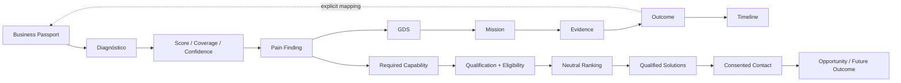

# Genesis 360 Empresarial — Fluxo de Valor V1

## Primeira cadeia
O usuário deve conseguir entender:
- problema;
- evidência;
- confiança;
- próxima ação.

## Segunda cadeia
A rede só aparece quando:
- pain possui capability;
- política está publicada;
- provider está qualificado;
- score atende threshold;
- compliance/capacidade atendem a policy;
- plano é elegível.

## Contact
Contato nunca é consequência automática de diagnóstico.
É uma ação do usuário com finalidade autorizada.
